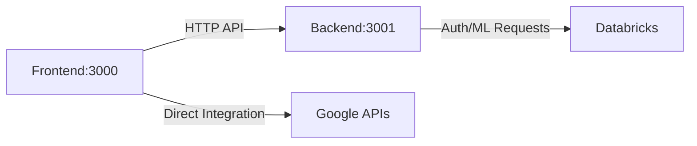

# CareConnect Project Structure

This document describes the reorganized project structure with proper separation of frontend and backend components.

## Directory Structure

```
CareConnect/
├── Makefile                    # Development automation (run, stop, install)
├── README.md                   # Project overview
├── .gitignore                  # Root-level ignores (logs, PIDs)
├── docs/                       # Project documentation
│   └── README.md
├── backend/                    # Backend API Server
│   ├── server.js              # Express API server
│   ├── package.json           # Backend dependencies
│   ├── README.md              # Backend documentation
│   ├── .env.example           # Environment template
│   ├── .gitignore             # Backend ignores
│   └── node_modules/          # Backend dependencies
└── frontend/                   # React Frontend
    ├── src/                   # React source code
    │   ├── components/        # React components
    │   ├── services/          # API services
    │   └── config/            # Configuration
    ├── public/                # Static assets
    ├── package.json           # Frontend dependencies
    ├── .env                   # Frontend environment variables
    ├── .gitignore             # Frontend ignores
    └── node_modules/          # Frontend dependencies
```

## Development Workflow

### Quick Start
```bash
# Install all dependencies
make install

# Start both backend and frontend
make run

# Stop all services
make stop
```

### Individual Services
```bash
# Backend only (port 3001)
make backend

# Frontend only (port 3000)
make frontend

# Check status
make status

# View logs
make logs
```

### Architecture

- **Backend**: Node.js/Express API server on port 3001
  - Handles Databricks integration
  - Provides REST APIs for frontend
  - Manages authentication and security
  
- **Frontend**: React app on port 3000
  - User interface and experience
  - Calls backend APIs
  - Google Maps/OAuth integration

## API Communication



## Environment Configuration

### Backend (.env)
```env
PORT=3001
REACT_APP_DATABRICKS_TOKEN=your_token
REACT_APP_DATABRICKS_WORKSPACE=your_workspace
REACT_APP_DATABRICKS_AGENT_ENDPOINT=your_endpoint
```

### Frontend (.env)
```env
REACT_APP_API_BASE_URL=http://localhost:3001/api
REACT_APP_GOOGLE_CLIENT_ID=your_google_client_id
REACT_APP_GOOGLE_MAPS_API_KEY=your_maps_api_key
```

## Benefits of This Structure

1. **Separation of Concerns**: Clear boundaries between frontend and backend
2. **Security**: Sensitive tokens stay on backend
3. **Scalability**: Services can be deployed independently
4. **Development**: Each team can work on their area
5. **CORS**: No browser limitations for API calls
6. **Production Ready**: Standard architecture pattern

## Makefile Commands

| Command | Description |
|---------|-------------|
| `make help` | Show all available commands |
| `make install` | Install dependencies for both services |
| `make run` | Start backend + frontend |
| `make stop` | Stop all services |
| `make backend` | Start only backend |
| `make frontend` | Start only frontend |
| `make status` | Check service status |
| `make logs` | View recent logs |
| `make clean` | Clean up processes and temp files |
| `make health-check` | Test API endpoints |
| `make test-databricks` | Test Databricks integration |
| `make build` | Build for production |

This structure provides a professional, maintainable, and scalable foundation for the CareConnect application.